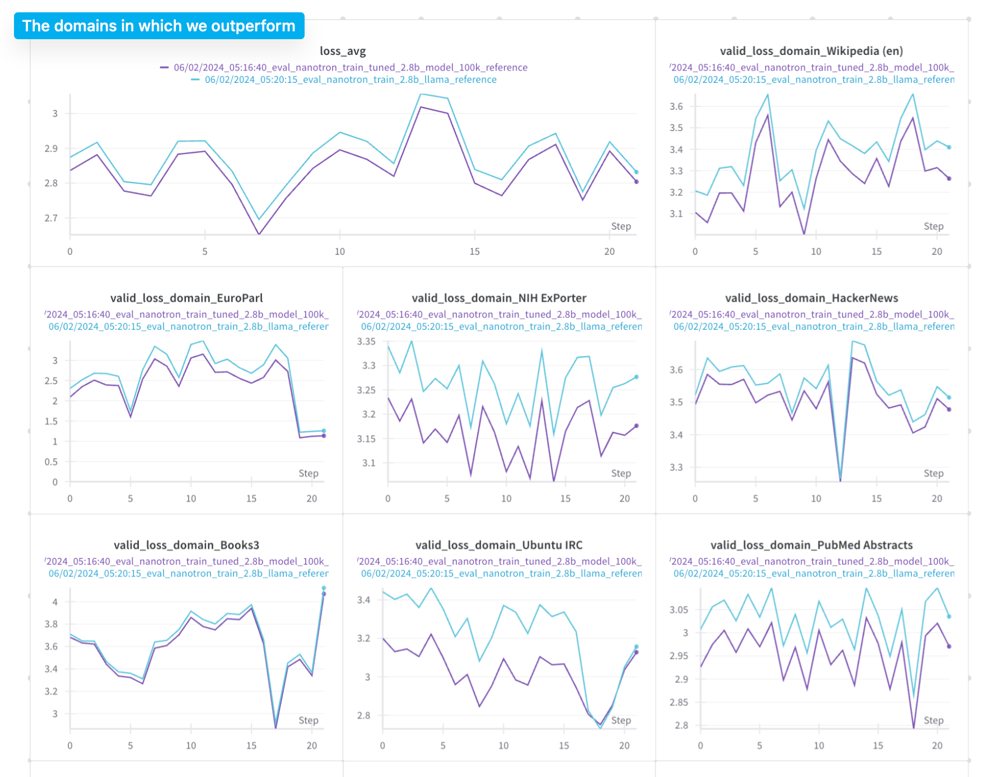

# DoReMi: Optimizing Data Mixtures Speeds Up Language Model Pretraining
Paper: https://arxiv.org/abs/2305.10429

You might think that one of the key ways to speed up pretraining performance is either by finding more quality data, increasing FLOPs, or changing the model architecture, but actually, these are not the only methods. DoReMi shows that, given the same source of training data, a model using an optimal data mixing strategy could outperform its counterpart with random sampling in at least 70% domains or all domains and downstream evaluations without any knowledge of the downstream evaluation tasks.

In our implementation, experiment results show that doremi outperforms 15 out of 22 domains on test set and has a lower average test loss. Comparison of the training losses between:
- 280M proxy and reference model [[link]](https://wandb.ai/neuralink/nanotron/reports/-DoReMi-280m-reference-vs-280m-proxy-s-training--Vmlldzo2NzYwNTU1)
- 2.5B reference and tuned weight models [[link]](https://wandb.ai/neuralink/nanotron/reports/-DoReMi-2-5B-tuned-weights-vs-2-5B-token-ratio-domain-weights-s-training--Vmlldzo2NzYwNzE2)
- And how the 280M proxy model's domain weights change during training [[link]](https://wandb.ai/neuralink/nanotron/runs/j9ojbso1?workspace=user-neuralink)





# How it works

- Step 0: Preprocessing data

- Step 1: Train a small reference model using uniform sampling from each domain (for a given global batch size, you equally sample `x` samples across all domains, or in some cases, a domain has a smaller amount of samples than other domains. This leads to some domains running out of samples early, so you could enable automatic domain weights based on the token count).

```bash
CUDA_DEVICE_MAX_CONNECTIONS=1 torchrun --nproc_per_node=4 examples/doremi/train_reference.py --config-file examples/doremi/config_280m_llama.yaml
```

- Step 2: Use the trained reference model from step 1 to train an identical model, and use its performance to dynamically tune the domain weights during training.

```bash
CUDA_DEVICE_MAX_CONNECTIONS=1 torchrun --nproc_per_node=4 examples/doremi/train_doremi.py --config-file examples/doremi/config_280m_llama_proxy.yaml
```

- Step 3: Nanotron saves the domain weights in the model checkpoint. Now, calculate the optimal domain weights by averaging the domain weights across all training steps from step 1: $\bar{\alpha}=\frac{1}{T} \sum_{i=1}^T \alpha_t$.

- Step 4: Use the optimized domain weights from step 3 to train a larger model (could be 10x to 30x larger). In our implementation, experimental results show that DoReMi outperforms 15 out of 22 domains on the test set and has a lower average test loss.

```bash
CUDA_DEVICE_MAX_CONNECTIONS=1 torchrun --nproc_per_node=4 examples/doremi/train_reference.py --config-file examples/doremi/config_2.8b_llama_with_tuned_weights.yaml
```

### Dataset

We expect the dataset path to link to a folder that already has tokenized data in the structure:

```
dataset
    domain_0
        ...
    domain_1
        ...
    domain_2
        ...
```

For each tokenized sample, we expect a column name `domain_ids` which contains the domain index of that domain in the dataset. For example, if a sample is from the third domain, it should have a `domain_ids` equal to 2.
